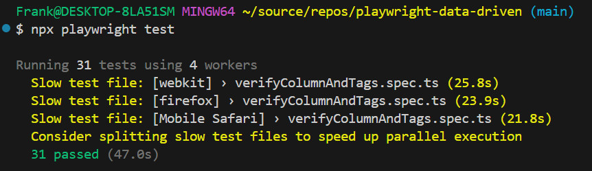

# playwright-data-driven
Playwright automated tests using data driven techniques

### Introduction: Overview of the task.
*  Create a Playwright-driven test suite that leverages data-driven techniques to minimize code duplication and improve scalability. By driving test scenarios from a JSON object, we can dynamically adapt each test case without repeating code, ensuring a clean and maintainable structure as new cases are added.

### Implementation Details: Explanation of the solution and its main components.
* Used npm init to build out initial structure and dependencies.
* Created page object and component objects to organize locators and function used in the spec file.
* Saved login authentication in setup file, to avoid step duplication for each test excecution.
* Used A Test Data file to keep the parameterized test data. This format (close to json) is used in the Playwright documentation and is used to avoid duplicated tests where only the data is changing, and also serves to document the test describe and test titles to be more specific to know at a glance what is being tested.

### Challenges and Solutions: Any obstacles and how they were addressed.
* The main challenge was getting the correct locators, and narrowing them down to ensure the text captured was accurate for comparison, but utilizing locator filtering provided a way forward.
* Another challenge was decreasing step duplication, which using stored authentication via a setup script worked well.

### Results: Summary of test run outcomes, noting any failures.
* All tests passed across chromium, firefox, and webkit, and the mobile viewports: Mobile Chrome - Pixel 5, and Mobile Safari - iPhone 12

### Recommendations: Suggestions for improvements to the features or the testing process.
* Perhaps splitting out the verification of tags into a separate test and running in parallel may decrease test execution time depending on resources.
* Add linting to make sure code stays clean
* Add formatter like prettier to ensure code stays formatted constistently
* Add tests to run using CI, and attach screenshots and/or trace files for debugging failures.